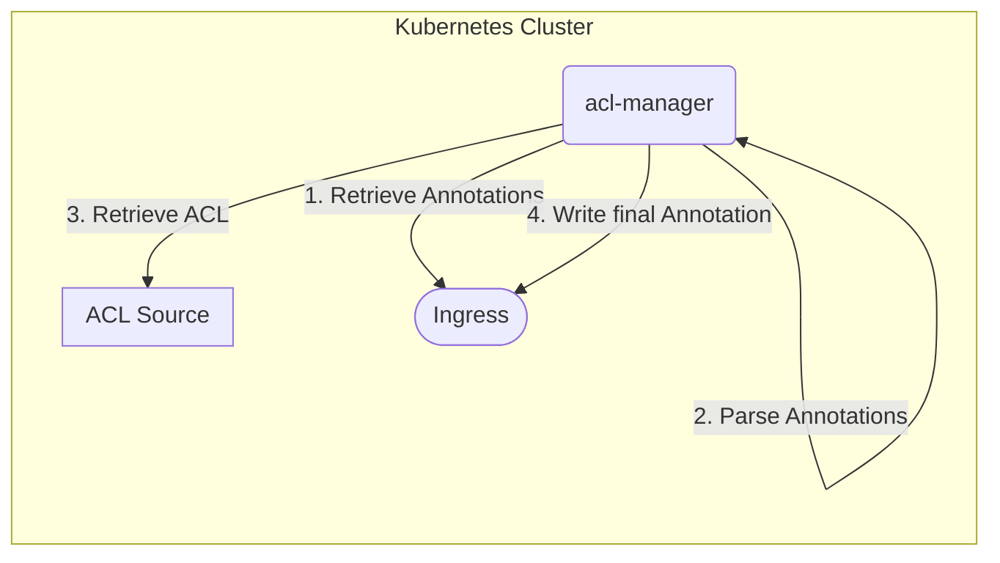

# acl-manager

Dynamically retrieves access control lists and applies them to Ingress resources.

## Overview



## Usage

| Annotation                           | Description              | Default                                             | Options                              |
| ------------------------------------ | ------------------------ | --------------------------------------------------- | ------------------------------------ |
| `acl-manager.konst.fish/list`        | Source ACL               | ``                                                  |                                      |
| `acl-manager.konst.fish/type`        | Source Type              | `http` (Auto-Discovered)                            | `http`, `dns`, `configmap`, `secret` |
| `acl-manager.konst.fish/format`      | ACL Type                 | `netlist`                                           | `netlist`, `csv`                     |
| `acl-manager.konst.fish/destination` | Final Ingress Annotation | `nginx.ingress.kubernetes.io/denylist-source-range` |                                      |
| `acl-manager.konst.fish/polling`     | Controller Refresh Rate  | `60` (Minutes)                                      |                                      |

### Minimal Example

```yaml
apiVersion: networking.k8s.io/v1
kind: Ingress
metadata:
  annotations:
    acl-manager.konst.fish/list: https://iplists.firehol.org/files/firehol_level1.netset
    # source type & format is autodiscovered
    # destination defaults to nginx denylist
    # denylist annotation is refreshed every 60 minutes
  name: ingress-with-http-denylist
```

### Elaborate Example
```yaml
apiVersion: networking.k8s.io/v1
kind: Ingress
metadata:
  annotations:
    acl-manager.konst.fish/list: friendly.example.com
    # list is retrieved from the DNS A records of the source domain
    # note this annotation is also auto discovered, if the list link is left bare (no protocol or trailing slash)
    acl-manager.konst.fish/type: dns
    # refreshed every 10 minutes
    acl-manager.konst.fish/polling: '10'
    # destination points to nginx allowlist
    acl-manager.konst.fish/destination: 'nginx.ingress.kubernetes.io/allowlist-source-range'
  name: ingress-with-dns-denylist
```

## Installation
todo

## Development

### Prerequisites

- go version v1.20.0+
- docker version 17.03+.
- kubectl version v1.11.3+.
- Access to a Kubernetes v1.11.3+ cluster.

### To Deploy on the cluster

**Build and push your image to the location specified by `IMG`:**

```sh
make docker-build docker-push IMG=<some-registry>/acl-manager:tag
```

**NOTE:** This image ought to be published in the personal registry you specified.
And it is required to have access to pull the image from the working environment.
Make sure you have the proper permission to the registry if the above commands don’t work.

**Install the CRDs into the cluster:**

```sh
make install
```

**Deploy the Manager to the cluster with the image specified by `IMG`:**

```sh
make deploy IMG=<some-registry>/acl-manager:tag
```

> **NOTE**: If you encounter RBAC errors, you may need to grant yourself cluster-admin
> privileges or be logged in as admin.

**Create instances of your solution**
You can apply the samples (examples) from the config/sample:

```sh
kubectl apply -k config/samples/
```

> **NOTE**: Ensure that the samples has default values to test it out.

### To Uninstall

**Delete the instances (CRs) from the cluster:**

```sh
kubectl delete -k config/samples/
```

**Delete the APIs(CRDs) from the cluster:**

```sh
make uninstall
```

**UnDeploy the controller from the cluster:**

```sh
make undeploy
```

## Contributing

**NOTE:** Run `make help` for more information on all potential `make` targets

More information can be found via the [Kubebuilder Documentation](https://book.kubebuilder.io/introduction.html)

## License

Copyright 2024.

Licensed under the Apache License, Version 2.0 (the "License");
you may not use this file except in compliance with the License.
You may obtain a copy of the License at

    http://www.apache.org/licenses/LICENSE-2.0

Unless required by applicable law or agreed to in writing, software
distributed under the License is distributed on an "AS IS" BASIS,
WITHOUT WARRANTIES OR CONDITIONS OF ANY KIND, either express or implied.
See the License for the specific language governing permissions and
limitations under the License.
